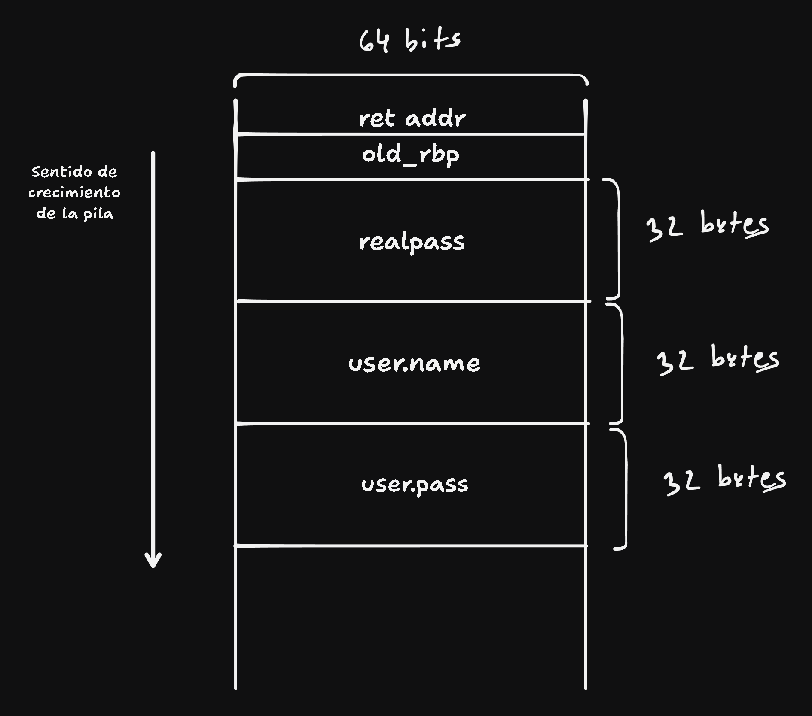

### a

Como se usa el size del user entero, puede escribir 64 bytes pisando tanto user.name como user.pass con el primer fgets y pisando user.pass y realpass con el segundo fgets

### b

Para el primer gets puede usar el usuario que quiera

Para el segundo gets tiene que colocar 2 valores de 32 bytes repetidos, cosa de escribir en user.pass y realpass el mismo valor. De esta forma se pisa el valor de realpass traido de la base de datos.

un ejemplo es $0x0000000000000000$